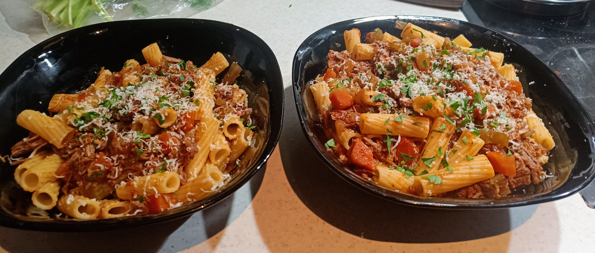

# Beef Ragu

# Ingredients

- 500g Beef chunks
- 1 Onion
- 3-5 Garlic cloves
- 1 Carrot
- 1 Celery stick
- Olive oil
- 2 tbsp Tomato paste
- Thyme sprigs
- Bay leaves
- 1 can Tomatoes, crushed
- 1-2 Beef stock cubes (OXO)
- ~250ml red wine
- Pasta of choice

# Method

- **Sear Beef:** In a heavy pot, heat some oil. Salt and pepper the beef chunks and brown them in the pot in batches. Remove and set aside.
- **Soffritto:** Finely dice the onion, carrot, and celery. Mince the garlic. Add to the pot on low to medium heat with oil/butter. Cook for a minimum of 10 minutes until soft.
- **Remaining Ingredients:** Add the red wine and reduce by half. Add the tomato paste and cook for a few minutes. Add the beef back to the pot. Add the crushed tomatoes, thyme, bay leaves, and beef stock cubes. Fill the tomato can with water and add that too.
- **Slow Cook:** Bring to a simmer and cook for at least 2 hours. The longer the better. Stir occasionally and add water if it gets too thick.
    - Alternatively, you can put it in the oven at 150°C for 2-3+ hours for a more hands-off approach.
- **Shred Beef:** Once the beef is tender, remove from the pot and shred with two forks. Return to the pot. The beef will get softer while you cook the pasta.
- **Pasta:** Cook the pasta according to the packet instructions. Reserve some pasta water.
- **Combine:** In a seperate pot, add the pasta and the ragu. Add some pasta water to help the sauce stick to the pasta. Serve with some grated parmesan and chopped parsley.
