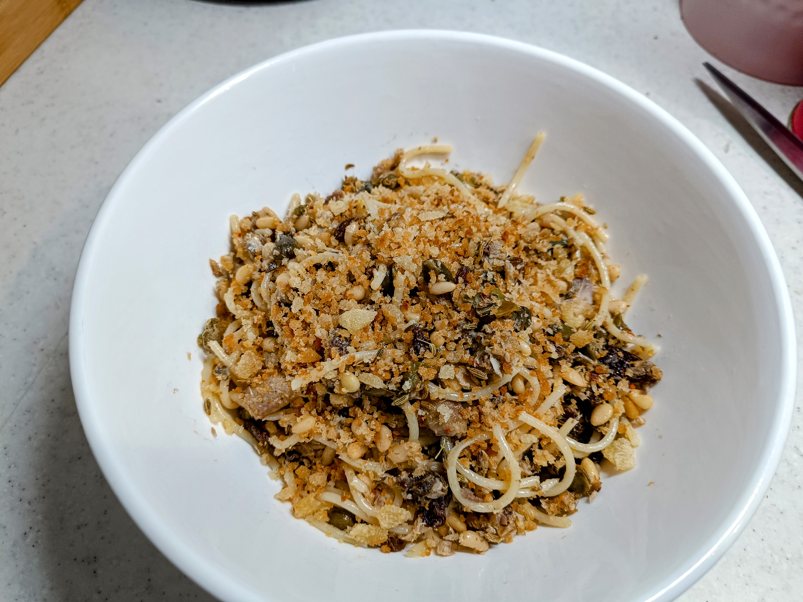

# Pasta con le sarde

## Ingredients

- 1 - 2 loaves of bread
- 1 tin of sardines in olive oil
- 2 cloves of garlic
- 1/2 tsp chilli flakes
- 1 tbsp fennel seeds (?)
- 3 tbsp pine nuts
- 3 tbsp raisins
- 3 tbsp capers
- 1 tbsp fennel seeds
- Spagetti

## Image

## Method

### Prep

#### Make the breadcrumbs

- Tear the bread into small pieces and blitz in a food processor or with an immersion blender.
- Heat a little olive oil in a pan and fry the breadcrumbs until golden brown.
- Place in a bowl with kitchen paper to drain.

#### Toast the fenel seeds`

- Heat a pan.
- Add the fennel seeds and toast until fragrant and slightly browned.

### Cook

- Heat a little olive oil in a pan.
- Add the garlic and fry until fragrant.